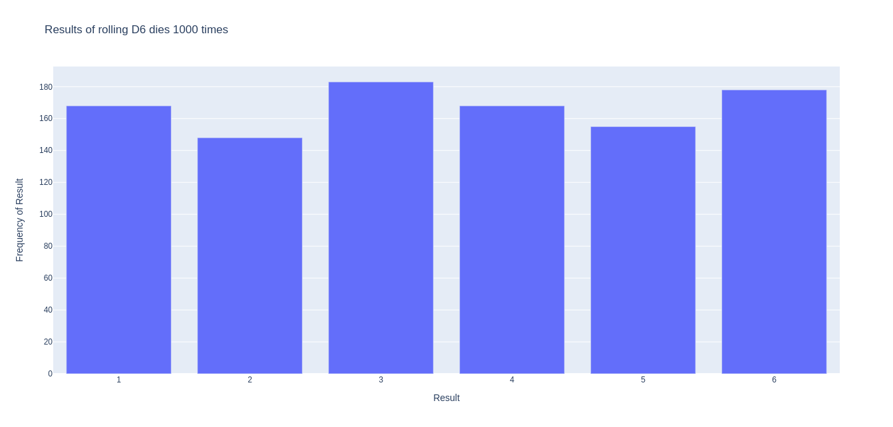
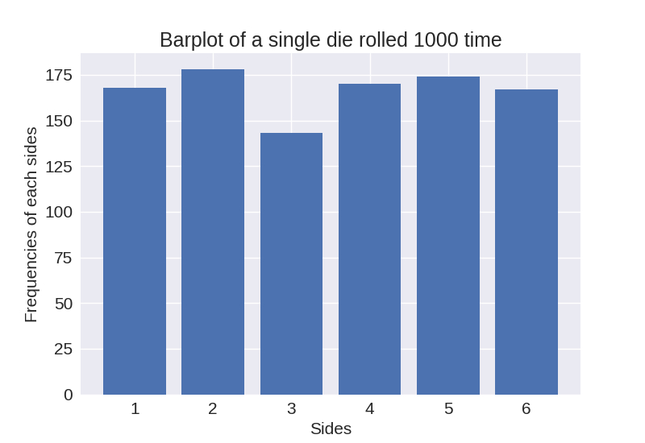
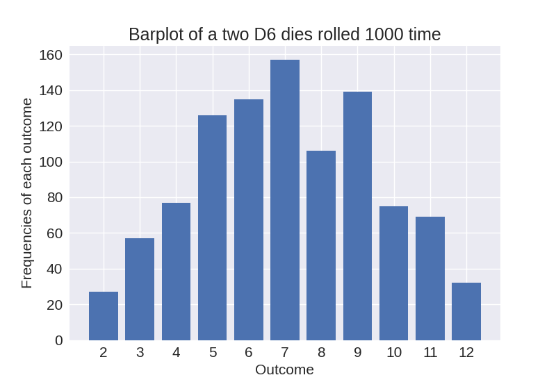
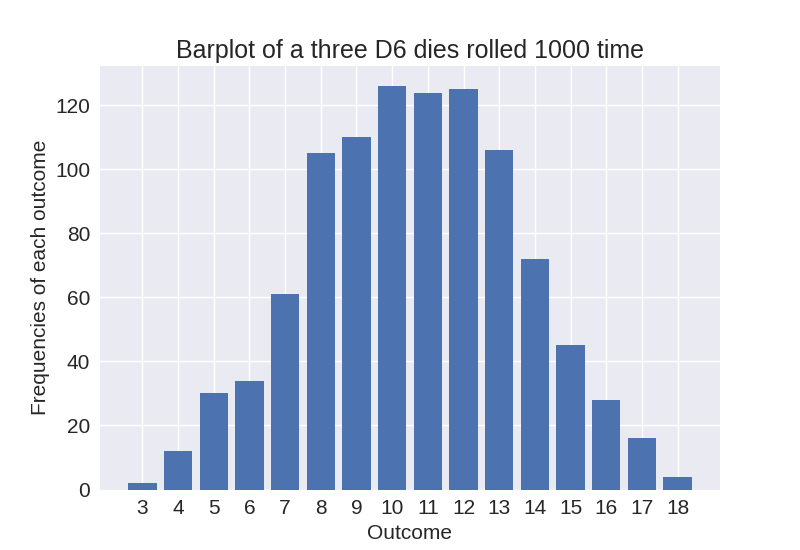

# Visualization-of-rolling-dies
libraries used: Plotly and matplotlib
# Previews of visualization of rolling dies in Plotly

.png)

.png)

# Previews of visualization of rolling dies in Matplotlib in seaborn style

